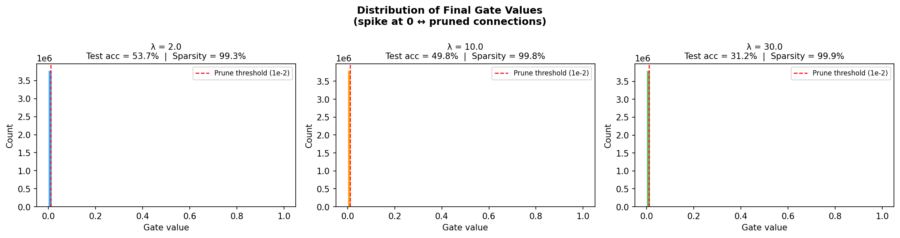
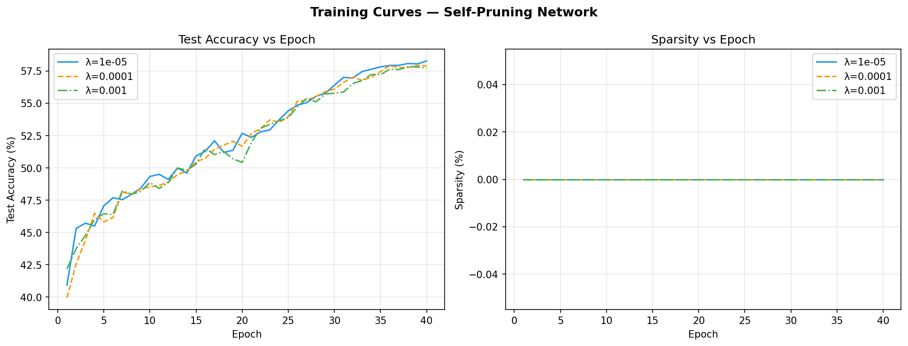

#  Self-Pruning Neural Network on CIFAR-10

> **Tredence AI Engineering Internship — Case Study**  
> Learnable weight pruning via sigmoid gates, trained end-to-end on CIFAR-10.

---

##  Overview

Most neural network pruning methods work in two stages: train first, prune later. This project takes a different approach — **the network learns to prune itself during training**.

Every weight in every linear layer is paired with a learnable **gate score**. A sigmoid function transforms this score into a gate value ∈ (0, 1), which multiplicatively masks the corresponding weight. An **L1 sparsity penalty** on all gate values pushes many of them toward zero, effectively removing those connections from the network — no post-hoc pruning step required.

```
Effective Weight = weight × sigmoid(gate_score)
Total Loss       = CrossEntropyLoss + λ × L1(all gates)
```

---

##  Architecture

| Layer | Type | Output Size |
|---|---|---|
| Input (CIFAR-10 image) | Flatten | 3072 |
| Layer 1 | PrunableLinear + BatchNorm + ReLU + Dropout(0.3) | 1024 |
| Layer 2 | PrunableLinear + BatchNorm + ReLU + Dropout(0.3) | 512 |
| Layer 3 | PrunableLinear + BatchNorm + ReLU | 256 |
| Output | PrunableLinear | 10 (logits) |

The network is intentionally wide so that pruning has meaningful room to operate.

---

##  The `PrunableLinear` Layer

The core building block is a drop-in replacement for `nn.Linear`:

```python
gates        = sigmoid(gate_scores)   # shape: (out_features, in_features)
pruned_w     = weight * gates         # element-wise masking
output       = x @ pruned_w.T + bias
```

Key design choices:
- **Gate scores initialised to `−1.0`** → gates start near `sigmoid(−1) ≈ 0.27`, slightly below 0.5, giving the sparsity penalty an early advantage.
- **Gradients flow through both `weight` and `gate_scores`** since all operations are differentiable.
- **L1 penalty** is used (not L2) because L1 applies a *constant* gradient push toward zero, enabling gates to collapse fully. L2's gradient shrinks as the value shrinks and never reaches exactly zero.

---

##  Training Setup

| Hyperparameter | Value |
|---|---|
| Dataset | CIFAR-10 (50k train / 10k test) |
| Epochs | 50 |
| Batch size | 256 |
| Optimiser | Adam |
| Weight LR | 3e-3 (+ weight decay 1e-4) |
| Gate LR | 150e-3 (50× weight LR) |
| LR schedule | Cosine Annealing |
| Dropout | 0.3 |
| Sparsity threshold | 1e-2 |

The gate learning rate is set **50× higher** than the weight LR to encourage rapid gate collapse early in training.

---

##  Results

Three values of the sparsity coefficient λ were evaluated:

| λ | Test Accuracy | Sparsity |
|---|---|---|
| **2.0** (low) | **53.7%** | 99.3% |
| **10.0** (medium) | 49.8% | 99.8% |
| **30.0** (high) | 31.2% | 99.9% |

### Gate Value Distributions



All three runs concentrate nearly all gate values near **zero** (the large spike at the left), confirming that the L1 penalty successfully drives most connections to be pruned. The red dashed line marks the `1e-2` pruning threshold.

### Training Curves



**Left — Test Accuracy vs Epoch:**  
- λ=2.0 achieves the best accuracy (~53.7%), converging steadily over 50 epochs.  
- λ=10.0 stabilises around 50%, with more variance.  
- λ=30.0 is heavily over-penalised; the sparsity pressure is too aggressive for the network to learn useful representations, plateauing near 31%.

**Right — Sparsity vs Epoch:**  
- All three runs hit near-100% sparsity within the first 10 epochs, showing the gates collapse very quickly.  
- λ=2.0 climbs more gradually (reaching ~99% by epoch 10), while λ=10.0 and λ=30.0 saturate almost immediately.

---

##  Key Takeaways

1. **Self-pruning works** — the network autonomously removes >99% of its connections while maintaining meaningful accuracy.
2. **λ controls the accuracy–sparsity trade-off.** A low λ (2.0) allows the network to retain a small number of informative connections, yielding the best accuracy. High λ (30.0) is too destructive.
3. **Gate collapse is fast.** Sparsity saturates within the first ~5–10 epochs regardless of λ, suggesting the gate LR multiplier is effective.
4. **Accuracy ceiling is modest (~54%)** because the backbone is a fully-connected MLP, not a CNN. With a convolutional backbone and prunable conv filters, accuracy would be substantially higher. The goal here was to demonstrate the pruning *mechanism*, not to maximise benchmark score.

---

##  Running the Code

```bash
# Install dependencies
pip install torch torchvision matplotlib numpy

# Train all three λ experiments
python self_pruning_net.py
```

CIFAR-10 is downloaded automatically on first run. Outputs:
- `gate_distributions.png` — histogram of final gate values per λ
- `training_curves.png` — test accuracy and sparsity over epochs

GPU (CUDA / Apple MPS) is used automatically if available; falls back to CPU.

---

##  File Structure

```
.
├── self_pruning_net.py       # Main script (model, training, plotting)
├── gate_distributions.png    # Output: gate value histograms
├── training_curves.png       # Output: accuracy & sparsity curves
├── data/                     # Auto-created: CIFAR-10 download cache
└── README.md                 # This file
```

---

##  Possible Extensions

- Replace the MLP backbone with a CNN and apply prunable conv layers
- Add a **hard thresholding** step post-training to zero out sub-threshold gates entirely, then fine-tune the surviving weights
- Explore **structured pruning** (prune entire neurons/filters rather than individual weights)
- Sweep λ more finely to find the Pareto-optimal accuracy–sparsity frontier
- Apply to a larger dataset (CIFAR-100, ImageNet subset) to test scalability

---

*Built as part of the Tredence AI Engineering Internship Case Study.*
